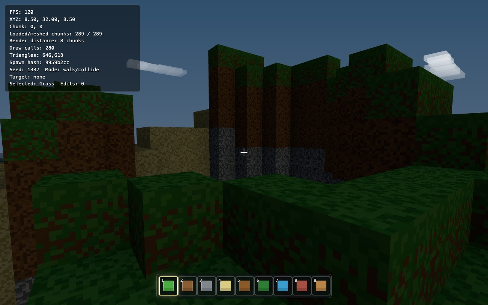
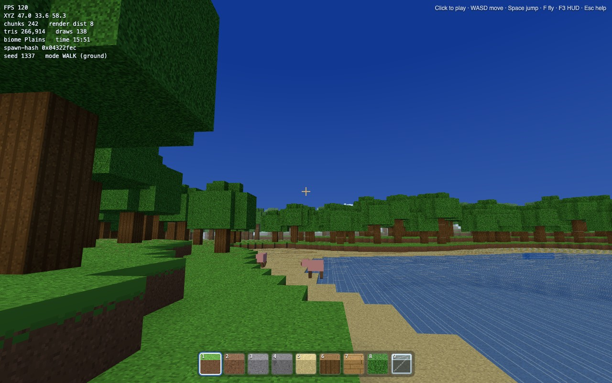
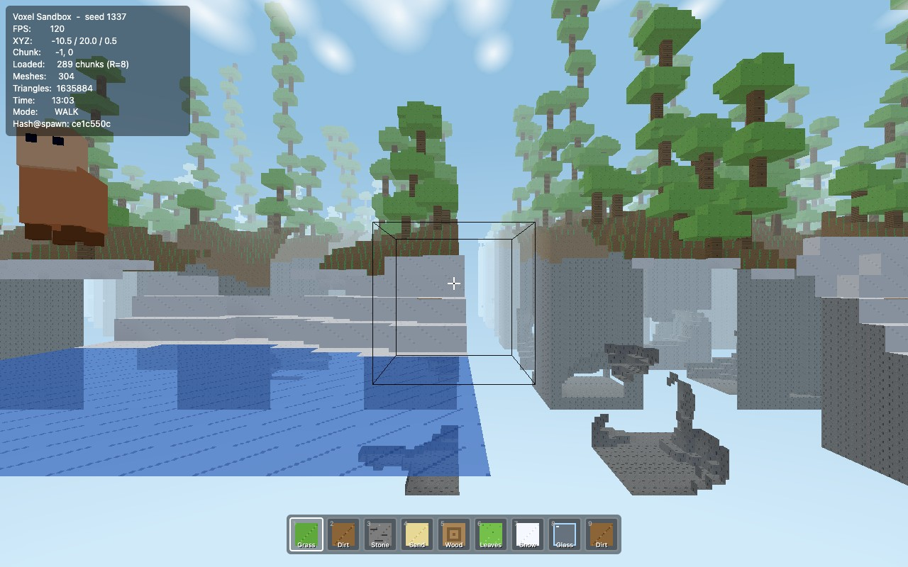
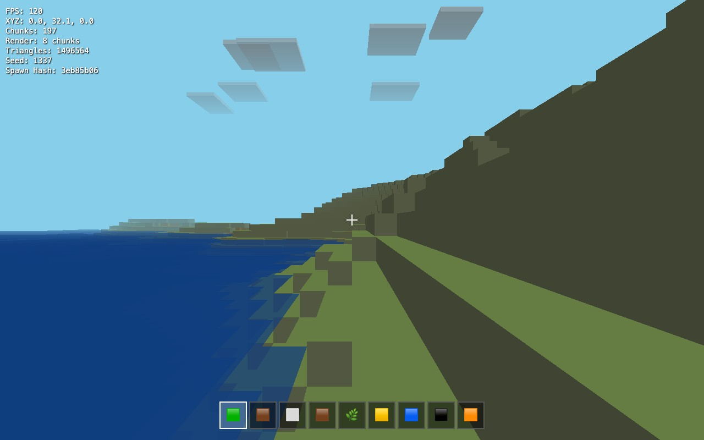

# Build-a-Minecraft-Clone — a four-agent coding benchmark

Four frontier coding agents were handed the **identical** prompt: build the closest possible
Minecraft clone as one self-contained `game.html` (Three.js, runs from `file://`, zero external
assets) plus living `docs.html`. Each was graded on **130 points** — Quality (100) + Documentation
(10) + Speed (20) — from source inspection **and live in-browser play**, then adversarially reviewed
twice (Claude + Codex). World seed 1337.

**▶ Play all four & read the full report → the live site:**
**https://tho-stack.github.io/minecraft-clone-benchmark/** &nbsp;*(enable once: Settings → Pages → branch `main`, folder `/docs`)*

Direct play links:
[Opus-4.8](https://tho-stack.github.io/minecraft-clone-benchmark/opus-4.8/game.html) ·
[GPT-5.5](https://tho-stack.github.io/minecraft-clone-benchmark/gpt-5.5/game.html) ·
[MiniMax-M3](https://tho-stack.github.io/minecraft-clone-benchmark/minimax-m3/game.html) ·
[MiniMax-2.7-highspeed](https://tho-stack.github.io/minecraft-clone-benchmark/minimax-m2.7-highspeed/game.html)

## Results

Two axes: **Capability** (raw rubric points — what the build contains, wired-up) and **Playable?** (can a person
actually move, break, place, and persist — the brief asked for a *playable* clone). The headline ranks playable builds first.

**Capability** (raw rubric, 0–100)

| # | Model | Capability | Playable? |
|---|-------|-----------:|:---------:|
| 1 | Opus-4.8 | **96.5** | ✓ |
| 2 | GPT-5.5 | **94.5** | ✓ |
| 3 | MiniMax-M3 | **65.0** | ✗ core loop broken |
| 4 | MiniMax-2.7-highspeed | **60.0** | ✓ (flat) |

M3 out-points 2.7 on raw capability (richer world + wired textures/AO) — but its core build loop is unusable, so it
fails the playability gate below.

**Overall** (playability-gated; Quality + Docs + Speed, 0–130)

| # | Model | Q | Docs | Speed | Total |
|---|-------|--:|-----:|------:|------:|
| 1 | GPT-5.5 | 94.5 | 10 | 4† | **108.5†** |
| 2 | Opus-4.8 | 96.5 | 9 | 2 | **107.5** |
| 3 | MiniMax-2.7-highspeed *(playable)* | 60.0 | 5 | 20 | **85.0** |
| 4 | MiniMax-M3 *(not playable\*)* | 65.0 | 5 | n/a\* | **broken\*** |

† GPT-5.5 Speed = ~35 min active labor; under strict elapsed timing (~205 min) it drops to Overall 105.5, just behind Opus.
\* MiniMax-M3 is ranked **last**: two duplicated `mousedown` handlers make every left-click break two blocks and every
right-click place two, and the save never restores position — the core build loop is unusable, so it fails the
playability gate regardless of its 65.0 capability. Its wall-clock was also distorted by a MiniMax **server-side
image-moderation incident** mid-run, so Speed isn't comparable.

## The four builds

| GPT-5.5 | Opus-4.8 |
|:--:|:--:|
|  |  |
| **MiniMax-M3** | **MiniMax-2.7-highspeed** |
|  |  |

*(All four captured live in-browser at **midday**, seed 1337. The day-night cycle is a graded feature — see the report for an Opus night shot.)*

## How it worked

- Identical [`PROMPT.md`](PROMPT.md) + an identical per-agent operating guide; graded against
  [`GRADING.md`](GRADING.md) under a **“working-integration” rubric** — a feature scores only if it’s
  actually wired into the running game, not merely declared in the manifest.
- **Two adversarial reviews**: a Claude workflow playing each build live, and Codex reviewing source.
  The report itself was then reviewed by Codex.
- **Honest caveats** (detailed in the report): the harnesses were **not identical** (different
  planning/verification plugins — a real confound; Opus self-verified via Playwright and Codex/GPT-5.5
  via Chrome DevTools Protocol, while Pi's vision pass was cut short by the incident),
  and MiniMax-M3 hit a MiniMax server-side image-moderation incident mid-run.
- **Model vs. harness — a SEPARATE 5th contestant (don't conflate with "MiniMax-M3 · Pi" above):** same M3 *model*,
  different *harness*. The round-1 entry (build dir `minimax-m3/`) is M3 driven by the third-party **Pi** agent; this one
  (build dir `minimax-code-m3/`) is the same model driven by MiniMax's *own* first-party agent — **MiniMax Code** (the
  `minimax`/Mavis CLI), in agent-team mode. Labeled **M3 · MiniMax Code** throughout, kept distinct from **M3 · Pi**. It
  gets the identical [`PROMPT.md`](PROMPT.md) + operating guide. For parity with round 1 (where each harness's planner
  decomposed the rubric itself) the team derives its own agent roles; the only non-identical token is the planner call
  (`/team` vs. Pi's `/goal` + dynamic workflow). Launch prompt:
  [`prompts/round1/goal-minimax-mavis.txt`](prompts/round1/goal-minimax-mavis.txt). **Round-1 result: NOT PLAYABLE —
  the worst of all five** (capability ≈ 40/100, last on the playable board). Live play + a Codex review found two
  showstoppers — any save bricks the world (no finite-guard → camera `NaN`), and the chunk mesher double-applies the
  world-offset so solid terrain renders as disconnected floating islands — plus a cosmetic-only seed and a save that
  never restores edits. It also burned the **most tokens and money of any contestant** (~34.2M tokens / $20.73 / 75 min):
  the model's own first-party harness was not the equalizer one might expect.
- **M3 · MiniMax Code — Round 2 (self-repair):** handed its own bug list, the team made a surgical 4-commit pass and
  **came out actually playable** — the only MiniMax build to *improve* in round 2 (both M3·Pi and 2.7 shipped showstopper
  regressions). Mesher offset applied once + corrected face table → one continuous world; save v2 schema + finite-guard
  round-trips properly; seed actually threaded; break/place verified one-per-click. Capability **≈40 → ≈70**. A Codex
  adversarial pass confirmed both blocker fixes but caught two caveats: the save's diff-vs-baseline is *wrong* (it diffs
  against pre-tree generation, so ~275/289 chunks are serialized as "edits" → 253 KB for 2 real edits, with a silently
  swallowed quota failure), and the biome fix is partial (grass/trees cover the map, but spawn still lands in water).
  Round-2 effort ~19.8M tokens / $12.06 / 34 min.
  [**▶ Play the round-2 build**](https://tho-stack.github.io/minecraft-clone-benchmark/round2/minimax-code-m3/game.html).
- **Round 2 — self-repair**: each agent was handed its own Round-1 bug list and fixed its build in
  place (assisted repair); re-graded by hands-on live-play + fresh Claude + Codex adversarial reviews.
  **Verdict: all four fixed their checklists, but only the frontier models stayed playable** — both
  MiniMax builds shipped showstopper regressions they couldn't self-catch. See the report's
  [Round 2 section](https://tho-stack.github.io/minecraft-clone-benchmark/#round2).

## Repo layout

```
docs/                       ← GitHub Pages site
  index.html                ← the full report (Round 1 + Round 2: scores, screenshots, issues)
  assets/                   ← screenshots
  <model>/game.html|docs.html         ← Round-1 playable clone + its docs
  round2/<model>/game.html|docs.html  ← Round-2 (self-repair) builds
PROMPT.md                   ← the identical build prompt (Round 1)
GRADING.md                  ← the 130-point rubric
prompts/                    ← every prompt used
  round1/                   ← per-harness launch prompts (Pi/Claude, Codex, MiniMax/Mavis, MiniMax/Hermes-kanban)
  round2/                   ← self-repair fix prompts + variance-study prompts
  reviews/                  ← the Claude/Codex adversarial-review prompts + Pi setup
harness/                    ← tooling + methodology
  probe.mjs · smoke.mjs     ← static + runtime grading harnesses (text output)
  PLAN.md · RESULTS.md      ← Round-2 design + full results/findings
  hermes-kanban-setup.md    ← MiniMax-M3 · Hermes (kanban) harness config
  setup-hermes-kanban.sh    ← reproduces the 5-agent M3/Hermes kanban squad
LICENSE                     ← Benchmark Evaluation License (report + AI-generated builds)
LICENSE-CODE                ← MIT (the harness, prompts, scripts)
```

## License — dual

- **Code: MIT** ([LICENSE-CODE](LICENSE-CODE)) — the harness (`harness/`, `probe.mjs`, `smoke.mjs`),
  all **prompts** (`prompts/`, `PROMPT.md`), and the rubric (`GRADING.md`). Run it, fork it, adapt it,
  even commercially, with attribution. Use these to run the benchmark against any agent.
- **Report + AI-generated builds: restricted** ([LICENSE](LICENSE) — Benchmark Evaluation License;
  non-commercial, no-derivatives, attribution) — the report (`docs/index.html`), screenshots
  (`docs/assets/`), and the model-generated `game.html`/`docs.html` builds (`docs/<model>/`,
  `docs/round2/<model>/`). View and run them; don't repackage or redistribute them as your own.

The eight `game.html` builds (four models × two rounds) were generated by their respective AI agents.
